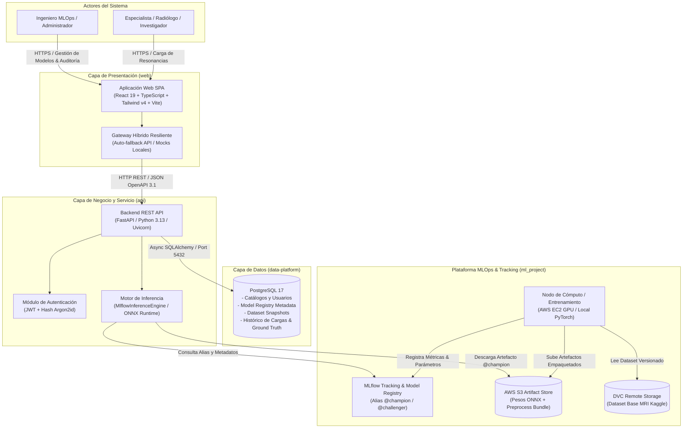
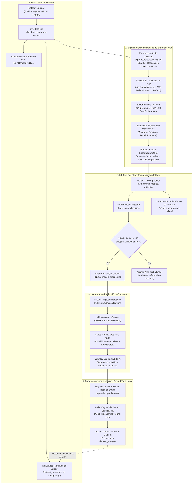
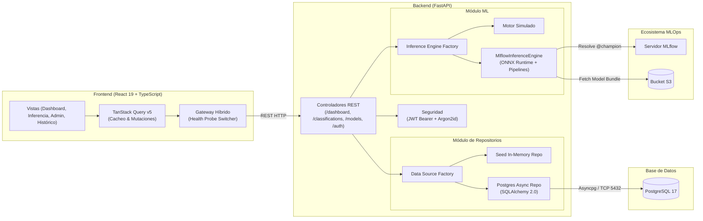
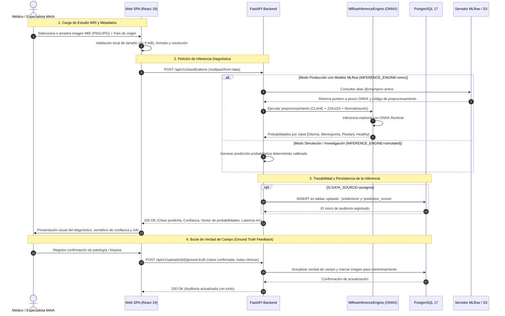
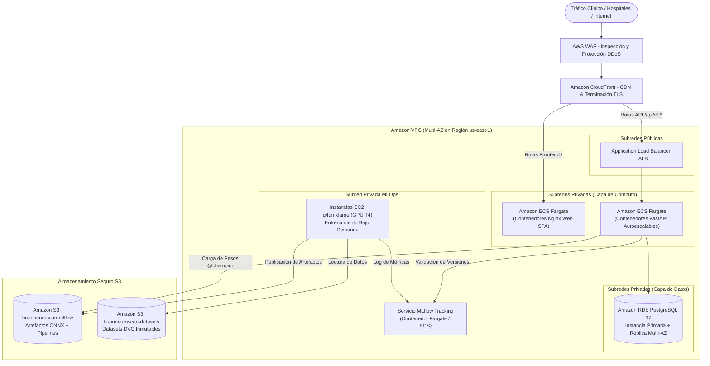

# Prototipo basado en Inteligencia Artificial para clasificación de tumores cerebrales en imágenes MRI

**Universidad de los Andes** — Maestría en Inteligencia Artificial Aplicada (MAIA)  
**Curso:** Proyecto - Desarrollo de Soluciones  
**Equipo de Desarrollo:**
- **Alex Chirino**
- **Breitner González**
- **Santiago Ramos**
- **Wilfrido Gómez**

---

[](https://www.python.org/)
[](https://fastapi.tiangolo.com/)
[](https://react.dev/)
[](https://www.typescriptlang.org/)
[](https://www.postgresql.org/)
[](https://mlflow.org/)
[](https://onnxruntime.ai/)
[](https://dvc.org/)
[](https://www.docker.com/)

> [!WARNING]
> **Aviso de uso académico y de investigación:** Esta solución corresponde a un prototipo desarrollado con fines estrictamente académicos e investigativos en el marco de la Maestría en Inteligencia Artificial Aplicada (MAIA) de la Universidad de los Andes. **No constituye un dispositivo médico certificado** ni cuenta con aprobaciones regulatorias sanitarias (FDA, CE-MDR o Invima). Ningún resultado producido por el sistema debe utilizarse como diagnóstico clínico vinculante sin la supervisión directa de un especialista médico certificado.

---

## 1. Resumen Ejecutivo y Descripción del Proyecto

El proyecto **«Prototipo basado en Inteligencia Artificial para clasificación de tumores cerebrales en imágenes MRI»** (denominado conceptualmente **BrainNeuroScan**) es una plataforma médica de analítica, inferencia de modelos de Deep Learning y gobernanza integral del ciclo de vida **MLOps**. 

Su objetivo principal es asistir a la comunidad médica y de investigación en la detección y clasificación oportuna de anomalías y neoplasias cerebrales a partir de estudios de **Resonancia Magnética (MRI)**, discriminando entre cuatro clases diagnósticas:

1. **Glioma (`glioma`)**: Neoplasia invasiva primaria que se origina en las células gliales del encéfalo.
2. **Meningioma (`meningioma`)**: Tumor de origen meníngeo (usualmente de crecimiento lento) localizado en las capas protectoras del cerebro.
3. **Tumor Pituitario (`pituitary`)**: Lesión o adenoma desarrollado en la glándula hipófisis (base del cráneo).
4. **Tejido Sano (`healthy` / `notumor`)**: Resonancia magnética libre de formaciones tumorales identificables.

### Fundamentos de Arquitectura de Software e Inteligencia Artificial

- **Arquitectura Desacoplada y Orientada a Microservicios:** Separación rigurosa de responsabilidades en 4 dominios funcionales independientes:
  1. `data-platform`: Persistencia relacional, linaje de datos e instantáneas reproducibles de datasets.
  2. `ml_project`: Entrenamiento, optimización, empaquetado y gobernanza de artefactos de Machine Learning.
  3. `api`: Backend de alta concurrencia en FastAPI, intermediario de seguridad y motor de inferencia desacoplado.
  4. `web`: Interfaz de usuario rica (SPA) con visualizaciones analíticas y capacidades *offline-first*.
- **Arquitectura MLOps con MLflow y Almacenamiento en S3:**
  - **Seguimiento de Experimentos (MLflow Tracking):** Registro sistemático de hiperparámetros (épocas, batch size, learning rate), funciones de pérdida y métricas diagnósticas ponderadas (*Accuracy*, *Precision Macro*, *Recall Macro*, *F1 Macro* y matrices de confusión).
  - **Registro Centralizado de Modelos (MLflow Model Registry):** Gobierno formal de versiones, transición de estados y asignación de alias operacionales (`champion` para el modelo activo en producción y `challenger` para la mejor alternativa candidata).
  - **Almacenamiento Desacoplado de Artefactos:** Persistencia de binarios optimizados (pesos ONNX, esquemas de configuración y metadatos) en buckets de **Amazon S3** (`s3://brainneuroscan-mlflow`).
- **Patrón de Diseño MLOps *"Transform"***: Todo el algoritmo de preprocesamiento (reescalado a $224 \times 224$, ecualización de histograma adaptativa limitada por contraste **CLAHE**, replicación a 3 canales y normalización ImageNet) viaja **empaquetado físicamente dentro del artefacto del modelo**. Esto elimina por diseño la desviación entre entrenamiento y servicio (*train-serve skew*).
- **Gateway Híbrido Resiliente (*Offline-First*)**: La capa web incorpora una sonda activa de conectividad (`/health`) que conmuta entre la API REST en producción y mocks en memoria ante indisponibilidad de infraestructura, garantizando estabilidad operacional y demostraciones ininterrumpidas.
- **Bucle de Aprendizaje Activo (*Ground Truth Loop*)**: Mecanismo de auditoría continua en donde el especialista puede validar o corregir el diagnóstico sugerido por el modelo, congelando instantáneas de datos en PostgreSQL para futuros ciclos de reentrenamiento.

---

## 2. Diagramas de Arquitectura de la Solución

### 2.1 Diagrama de Arquitectura Global de la Solución (C4 - Nivel 2)

Ilustra la interacción de alto nivel entre los usuarios, las capas de cómputo, almacenamiento y el ecosistema MLOps con MLflow:



---

### 2.2 Diagrama de Proceso (Ciclo de Vida MLOps Continuo con MLflow)

Modela el flujo continuo desde la ingesta de datos hasta el reentrenamiento supervisado con intervención humana:



---

### 2.3 Diagrama de Componentes Internos del Sistema

Detalla la arquitectura modular de capas de software y sus dependencias técnicas:



---

### 2.4 Diagrama de Flujo (Workflow Clínico de Inferencia y Auditoría)

Secuencia cronológica de operaciones entre el usuario y los subsistemas:



---

## 3. Estructura del Repositorio

El monorepositorio está organizado de manera modular en las siguientes áreas de trabajo:

```plaintext
maia-pds-microproyecto/
├── api/                     # Backend REST en FastAPI (Python 3.13)
│   ├── app/                 # Código de la aplicación (routers, core, ml, db, schemas)
│   │   ├── api/v1/          # Endpoints OpenAPI 3.1 (/classifications, /models, /dashboard, etc.)
│   │   ├── ml/              # Implementaciones de motores de inferencia (simulated, onnx, mlflow)
│   │   ├── repositories/    # Abstracción de acceso a datos (patrón Repository)
│   │   ├── seed/            # Generadores deterministas de datos de prueba en memoria
│   │   └── main.py          # Inicializador de FastAPI, middlewares y ciclo de vida
│   ├── alembic/             # Migraciones automáticas del esquema SQLAlchemy
│   ├── Dockerfile           # Imagen de producción multi-stage sin privilegios root
│   ├── docker-compose.yml   # Orquestador del servicio API
│   └── requirements.txt     # Dependencias de backend
├── data-platform/           # Capa de base de datos relacional (PostgreSQL 17)
│   ├── scripts/             # Scripts ordenados DDL (esquema) y DML (semillas de datos)
│   │   ├── ddl/             # Extensiones, tipos, funciones, tablas y vistas
│   │   ├── dml/             # Carga inicial de catálogos, modelos y datasets
│   │   └── init/            # 00_ejecutar_todo.sh (inicializador transaccional con ON_ERROR_STOP)
│   ├── tools/               # Generador automatizado de semillas
│   ├── docker-compose.yml   # Contenedor oficial de PostgreSQL 17 Alpine con healthcheck
│   └── README.md            # Documentación del esquema relacional y snapshots
├── ml_project/              # Pipeline MLOps de entrenamiento y ciclo de vida
│   ├── pipelines/           # Módulos reutilizables del ciclo de Machine Learning
│   │   ├── preprocessing.py # Patrón Transform: preprocesamiento reproducible CLAHE + norm
│   │   ├── dataset.py       # Particionado sin fuga de datos y escaneo de imágenes
│   │   ├── training.py      # Lógica de optimización, épocas y validación en PyTorch
│   │   ├── packaging.py     # Empaquetado de modelos ONNX con MLflow pyfunc
│   │   └── train.py         # Entrypoint CLI configurable para entrenamiento
│   ├── docs/                # Runbooks técnicos (entrenamiento en AWS EC2 + MLflow + S3)
│   ├── tests/               # Pruebas de paridad matemática (test_transform_parity.py)
│   └── requirements-train.txt # Dependencias con soporte GPU (PyTorch, Torchvision, ONNX)
├── web/                     # Frontend SPA (React 19 + TypeScript + Vite + Tailwind v4)
│   ├── src/                 # Código fuente de componentes, páginas, hooks y contexto
│   │   ├── components/      # UI components (shadcn/ui, Recharts, mapas coropléticos)
│   │   ├── pages/           # Vistas (Dashboard, Inferencia, Admin de Modelos, Histórico)
│   │   └── services/        # Cliente HTTP Axios y lógica del Gateway Híbrido
│   ├── docker/              # Plantilla Nginx y script de inyección en runtime (entrypoint.sh)
│   ├── Dockerfile           # Compilación optimizada Node.js + Nginx Alpine
│   └── docker-compose.yml   # Orquestador de la aplicación web
├── data/                    # Directorio de datos versionados bajo DVC (.dvc)
├── notebooks/               # Cuadernos Jupyter para EDA y experimentación exploratoria
├── reports/                 # Figuras, tablas e informes de análisis exploratorio
├── scripts/                 # Scripts auxiliares (e.g. ejecución automatizada de EDA)
└── tests/                   # Pruebas de integración a nivel raíz
```

---

## 4. Guía de Ejecución Local

### 4.1 Prerrequisitos del Sistema

- **Docker & Docker Compose** (versión 24.0 o superior).
- **Python 3.11+** (para desarrollo local de la API o ejecución del pipeline de entrenamiento).
- **Node.js 20+** y **npm 10+** (para el desarrollo de la interfaz web).
- **Git & DVC** (para la gestión de código y sincronización del dataset).

---

### 4.2 Sincronización del Dataset Clínico (DVC)

El conjunto de datos comprende **7.023 imágenes de resonancias magnéticas** clasificadas en las 4 patologías de estudio. Para descargarlo y descomprimirlo en la ruta correspondiente:

```bash
# 1. Crear y activar el entorno virtual principal
python3 -m venv .venv
source .venv/bin/activate

# 2. Instalar el cliente DVC con dependencias
pip install -r requirements.dvc.txt

# 3. Descargar el dataset desde el repositorio remoto configurado
dvc pull -r public

# 4. Extraer el archivo comprimido en data/
unzip -q data/brain-tumor-mri-scans.zip -d data/
```

---

### 4.3 Opción A: Puesta en Marcha con Docker Compose

Cada componente cuenta con su propia configuración de Docker Compose, permitiendo arrancar la solución por módulos según la necesidad:

#### 1. Iniciar la Base de Datos (PostgreSQL 17):
```bash
cd data-platform
cp .env.example .env
docker compose up -d

# Validar que el contenedor esté saludable (healthy)
docker compose ps
cd ..
```

#### 2. Iniciar la API Backend (FastAPI):
```bash
cd api
cp .env.example .env

# Nota: Por defecto opera con DATA_SOURCE=seed e INFERENCE_ENGINE=simulated.
# Si deseas vincular la base de datos real, edita .env con DATA_SOURCE=postgres.
docker compose up -d --build
cd ..
```

#### 3. Iniciar la Aplicación Web (React + Nginx):
```bash
cd web
cp .env.example .env
docker compose up -d --build
cd ..
```

#### Verificación de Servicios:
- **Frontend SPA:** [http://localhost:8080](http://localhost:8080)
- **API Swagger UI:** [http://localhost:8000/docs](http://localhost:8000/docs)
- **API ReDoc:** [http://localhost:8000/redoc](http://localhost:8000/redoc)
- **API Health Check:** [http://localhost:8000/health](http://localhost:8000/health)

---

### 4.4 Opción B: Ejecución en Modo Desarrollo Nativo

Si vas a modificar código con soporte para recarga en caliente (*hot-reloading*):

#### Paso 1: Base de Datos en Contenedor
Inicia únicamente la base de datos para contar con el esquema DDL y semillas DML precargadas:
```bash
cd data-platform
cp .env.example .env
docker compose up -d
cd ..
```

#### Paso 2: Backend API (FastAPI)
```bash
cd api
python3 -m venv .venv
source .venv/bin/activate
pip install -r requirements.txt
cp .env.example .env

# Variables clave en api/.env:
# DATA_SOURCE=postgres       (o 'seed' para ejecución en memoria)
# INFERENCE_ENGINE=simulated  (o 'onnx' para inferencia real con MLflow)
# ALLOWED_ORIGINS=http://localhost:5173

uvicorn app.main:app --reload --host 0.0.0.0 --port 8000
```

#### Paso 3: Frontend Web (Vite + React)
En una nueva terminal:
```bash
cd web
npm ci
cp .env.example .env
# VITE_API_BASE_URL=http://localhost:8000
npm run dev
```
La aplicación web estará disponible en [http://localhost:5173](http://localhost:5173).

#### Paso 4: Entrenamiento y Registro de Modelos con MLflow (MLOps)
Para ejecutar el pipeline de entrenamiento local o distribuido conectándose a un servidor de MLflow:
```bash
cd ml_project
python3 -m venv .venv
source .venv/bin/activate
pip install -r requirements-train.txt

# Ejecución del pipeline con MLflow Tracking y selección de Champion
python -m pipelines.train \
  --data-dir ../data/brain-tumor-mri-scans \
  --arch cnn_simple --arch resnet18 \
  --epochs 5 \
  --tracking-uri "https://mlflow.alexchirino.online" \
  --experiment "brain-tumor-mri-classification"
```

---

### 4.5 Cuentas y Credenciales de Demostración

El sistema incluye usuarios preconfigurados en la base de datos para validar los diferentes roles y niveles de acceso:

| Rol de Usuario | Nombre de Usuario | Contraseña | Permisos y Capacidades |
|---|---|---|---|
| **Administrador / ML Engineer** | `admin` | `admin123` | Despliegue y reversión de modelos (*Champion*), carga de pesos, gestión de datasets y auditoría total |
| **Especialista Clínico / Patólogo** | `demo` | `demo` | Carga de resonancias, inferencia diagnóstica, registro de diagnósticos de confirmación (*Ground Truth*) |
| **Auditor / Revisor** | `viewer` | `viewer123` | Consulta del panel epidemiológico y lectura de estadísticas |

---

## 5. Estrategias y Arquitectura de Despliegue

La solución está concebida bajo la metodología **Twelve-Factor App**, garantizando que la configuración se gestione estrictamente por variables de entorno y que los procesos sean desechables y sin estado (*stateless*).

### 5.1 Despliegue Rápido en Plataformas PaaS / Contenedores (Railway / Render / Fly.io)

1. **Frontend Web (`web/Dockerfile`)**:
   - Compilación multi-stage basada en `node:24-alpine` para construir los artefactos estáticos.
   - Ejecución sobre `nginx:1.27-alpine` optimizado.
   - **Inyección dinámica de variables (`docker/entrypoint.sh`):** Al arrancar el contenedor, el script genera el archivo `env-config.js` en `/usr/share/nginx/html/` con las variables inyectadas por la plataforma (`VITE_API_BASE_URL`), desacoplando completamente la construcción de la imagen de su entorno de ejecución.
2. **Backend API (`api/Dockerfile`)**:
   - Basado en `python:3.13-slim` con usuario sin privilegios root (`apiuser`, UID 10001).
   - Servidor ASGI Uvicorn escuchando en el puerto parametrizable `${PORT:-8000}`.
   - Conexión transparente hacia bases de datos administradas (Supabase, Railway Postgres o AWS RDS) mediante la variable `DATABASE_URL`.

---

### 5.2 Arquitectura Empresarial de Producción en AWS (Nube de Alta Disponibilidad)

Para un despliegue hospitalario o de investigación clínica que requiera alta disponibilidad, cumplimiento normativo y aislamiento estricto de red, se diseña la siguiente topología en **Amazon Web Services (AWS)**:



#### Componentes de la Arquitectura de Nube:
- **Borde y Seguridad:** **AWS WAF** protege los endpoints contra ataques comunes OWASP; **Amazon CloudFront** realiza la terminación TLS 1.3 con certificados de AWS Certificate Manager (ACM) y distribuye los assets del frontend con latencia mínima.
- **Cómputo en Contenedores sin Servidor:** **Amazon ECS con AWS Fargate** orquesta tanto la aplicación web como la API REST. El backend escala horizontalmente de forma automática (Auto Scaling) basado en CPU y latencia reportada por la cabecera `X-Process-Time-Ms`.
- **Persistencia Confiable:** **Amazon RDS para PostgreSQL 17** en esquema Multi-AZ con conmutación por error automática (*failover*), copias de seguridad continuas y cifrado en reposo mediante **AWS KMS**.
- **Plataforma MLOps:**
  - Instancias **EC2 `g4dn.xlarge`** con GPU NVIDIA T4 dedicadas a entrenamientos programados, aprovisionadas bajo demanda para optimizar costos de cómputo.
  - Almacenamiento desacoplado en **Amazon S3** con políticas IAM de mínimo privilegio (*Least Privilege*), evitando el almacenamiento de credenciales estáticas en código o imágenes Docker.
  - Servidor central de **MLflow** para la gobernanza estricta de versiones y linaje de modelos.

---

## 6. Pruebas y Aseguramiento de Calidad MLOps

El repositorio incorpora una batería integral de pruebas unitarias, de integración y de paridad matemática:

```bash
# 1. Pruebas de Paridad del Patrón Transform (MLOps)
cd ml_project
pytest -v tests/test_transform_parity.py

# 2. Pruebas de Contratos, Autenticación y Endpoints de la API
cd ../api
pytest -v

# 3. Verificación de Tipado Estricto y Linter en el Frontend
cd ../web
npx oxlint
npm run build
```

- **Prueba de Paridad del Patrón Transform (`test_transform_parity.py`)**: Verifica que la imagen preprocesada mediante el paquete incrustado en el artefacto de MLflow y la procesada por el pipeline local produzcan tensores matemáticamente idénticos, garantizando que el modelo se comporte en producción exactamente igual que en validación.
- **Control Negativo de Preprocesamiento**: Confirma que cualquier alteración en el pipeline de transformación altere sensiblemente las probabilidades predichas, evitando aprobaciones espurias.
- **Protección Anti-Fuga de Datos (*Anti-Data-Leak Guard*)**: Algoritmo de partición que previene la presencia de imágenes de un mismo paciente o secuencia en los conjuntos de entrenamiento y prueba simultáneamente.

---

## 7. Información Institucional y Licencia

- **Institución:** [Universidad de los Andes](https://uniandes.edu.co/), Bogotá, Colombia.
- **Programa Académico:** [Maestría en Inteligencia Artificial Aplicada (MAIA)](https://sistemas.uniandes.edu.co/es/maia).
- **Curso:** Proyecto - Desarrollo de Soluciones.
- **Equipo de Trabajo:**
  - Alex Chirino
  - Breitner González
  - Santiago Ramos
  - Wilfrido Gómez
- **Licencia:** Distribuido bajo la Licencia **MIT**. Consulte los archivos de licencia correspondientes en el repositorio para mayores detalles.
