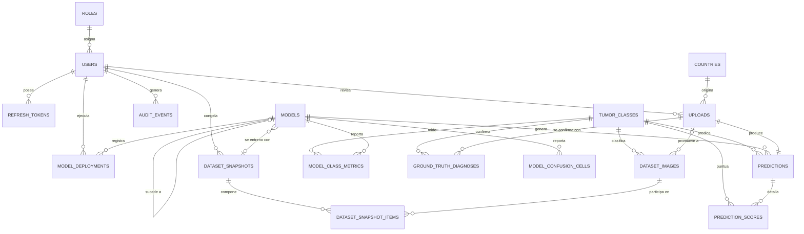

# model — Base de datos de BrainNeuroScan

Esquema **PostgreSQL 17** de la plataforma: catálogos, usuarios, registro de
modelos, dataset con instantáneas reproducibles, cargas de usuarios con sus
predicciones, verdad de campo y auditoría.

> ⚠️ Prototipo de investigación. No es un dispositivo médico y no cuenta con
> certificaciones vigentes.

## Arranque

```bash
cp .env.example .env
docker compose up -d
docker compose exec db psql -U brainneuroscan -d brainneuroscan
```

Reinicio desde cero, que vuelve a ejecutar todos los scripts:

```bash
docker compose down -v && docker compose up -d
```

El `-v` es lo que borra el volumen. Sin él Postgres **no** reinicializa, porque
`/docker-entrypoint-initdb.d` sólo se ejecuta cuando el directorio de datos está
vacío.

## Orden de ejecución

`scripts/init/00_ejecutar_todo.sh` fuerza el orden correcto: primero todo el DDL
y después el DML. No se confía en el orden alfabético que aplica Postgres,
porque el DML depende del DDL completo. El script usa `ON_ERROR_STOP=1`: si un
fichero falla, el contenedor muere en vez de quedarse con un esquema a medias.

```
scripts/
├── ddl/   01_extensiones · 02_tipos · 03_funciones · 04_catalogos · 05_usuarios
│          06_modelos · 07_dataset · 08_cargas · 09_auditoria · 10_vistas
├── dml/   01_catalogos · 02_usuarios · 03_modelos · 04_dataset · 05_cargas
└── init/  00_ejecutar_todo.sh
```

Los ficheros de `dml/` están **generados** por `tools/generar_semillas.py` a
partir de `api/app/seed/`, que a su vez replica el generador del frontend. Las
tres capas comparten así una única definición de los datos de demostración: si
cambia la semilla, se regenera con

```bash
../api/.venv/bin/python tools/generar_semillas.py
```

## Modelo entidad–relación



## Tablas

| Tabla | Propósito | Filas semilla |
|---|---|---|
| `roles` | Catálogo de roles | 3 |
| `users` | Usuarios de la plataforma, con hash Argon2id | 3 |
| `refresh_tokens` | Tokens de refresco con revocación | 0 |
| `countries` | ISO-3166-1 α-2 con nombre bilingüe y coordenadas | 28 |
| `tumor_classes` | Clases con etiqueta, color, orden y marca `is_tumor` | 4 |
| `models` | Registro de modelos y punteros a MLflow | 5 |
| `model_class_metrics` | Métricas por clase y modelo | 20 |
| `model_confusion_cells` | Matriz de confusión (real × predicha) | 80 |
| `model_deployments` | Bitácora de despliegues y reversiones | 10 |
| `dataset_images` | Imágenes del dataset con su partición | 7 023 |
| `dataset_snapshots` | Composición congelada del dataset | 1 |
| `dataset_snapshot_items` | Qué imágenes componen cada instantánea | 7 023 |
| `uploads` | Imágenes enviadas por usuarios | 120 |
| `predictions` | Resultado de inferencia por carga | 120 |
| `prediction_scores` | Probabilidad por clase de cada predicción | — |
| `ground_truth_diagnoses` | Diagnóstico confirmado por especialista | 56 |
| `audit_events` | Auditoría de acciones sensibles | 0 |

## Vistas

Los KPI se definen **una sola vez, aquí**. La API los sirve y el frontend sólo
replica las fórmulas en su modo de datos simulados.

| Vista | Qué responde |
|---|---|
| `vw_dataset_distribution` | Distribución del dataset por clase y partición |
| `vw_uploads_by_country` | Volumen de cargas por país (mapa del panel) |
| `vw_uploads_by_month` | Cargas por mes |
| `vw_upload_ground_truth` | Detalle de cada carga con predicción y verdad de campo |
| `vw_ground_truth_performance` | Cobertura y precisión real medida |
| `vw_ground_truth_performance_by_class` | Lo mismo, desglosado por clase |
| `vw_ground_truth_performance_by_country` | Lo mismo, por país |
| `vw_upload_history_summary` | Los cuatro indicadores del histórico |
| `vw_model_registry_summary` | Modelo en producción, accuracy y almacenamiento |

Consulta de comprobación tras el arranque:

```sql
SELECT * FROM vw_ground_truth_performance;
```

Con la semilla actual devuelve `120 | 56 | 44 | 12 | 46.67 | 78.57`, los mismos
valores que sirven el API y el frontend.

## Decisiones de modelado

- **Una confirmación vigente por carga**, impuesta por un índice único parcial
  sobre `deleted_at IS NULL`. Corregir un diagnóstico marca el anterior como
  borrado y conserva el historial: una lectura de especialista que después
  desmiente la anatomía patológica no puede perderse.
- **Como máximo un modelo en producción**, impuesto por otro índice único
  parcial. Lo garantiza la base de datos y no la aplicación: si dos despliegues
  concurrentes intentan promover a la vez, uno falla en lugar de dejar el
  sistema con dos campeones.
- **`is_correct` es `NULL`, no `false`, cuando no hay diagnóstico confirmado.**
  «Desconocido» no es «error»; confundirlos haría inservible la precisión real.
- **Los binarios no viven en la base de datos**: sólo la ruta y el `sha256`. Las
  imágenes van al almacenamiento de objetos y los pesos al almacén de artefactos
  de MLflow.
- **Borrado lógico** en usuarios, modelos, cargas y diagnósticos: la auditoría
  debe poder citar entidades retiradas.
- **Instantáneas del dataset** con la composición imagen a imagen, no sólo
  conteos: sin ellas, promover una carga al dataset haría irreproducible
  cualquier reentrenamiento posterior.

## Diccionario de datos

En [`docs/diccionario-datos.md`](docs/diccionario-datos.md), columna a columna,
con tipos, nulabilidad, valores por defecto, descripción y restricciones.
