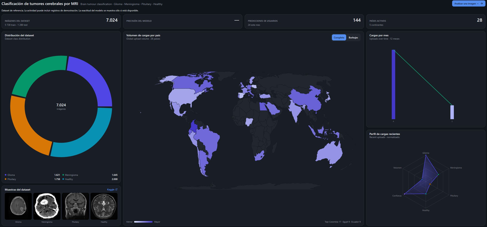
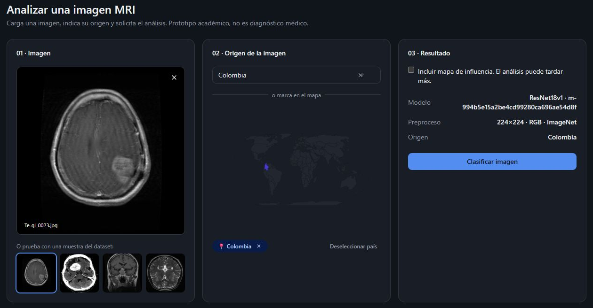
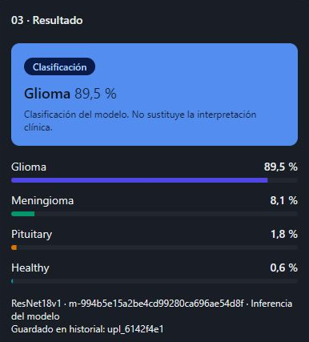
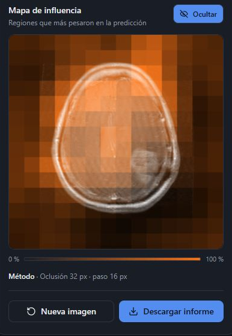
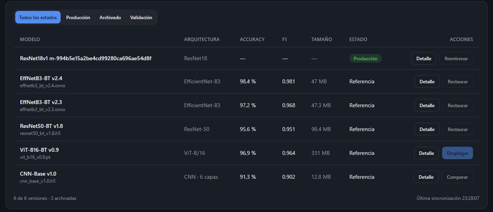
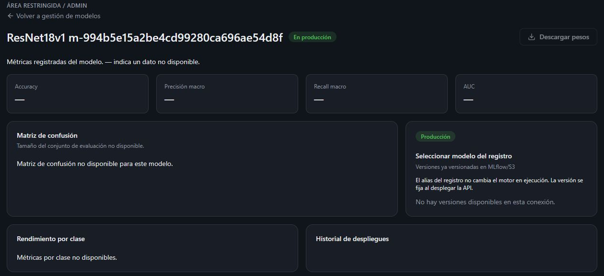
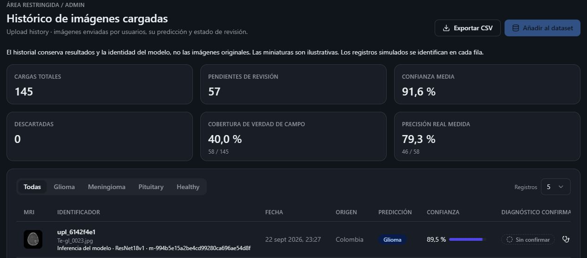
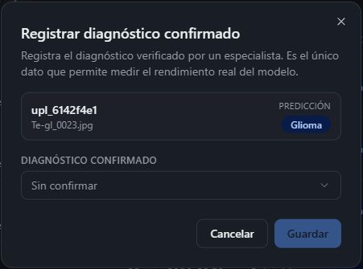

# Manual de usuario del tablero

BrainNeuroScan

Versiones en [Word y PDF](https://github.com/apchirinoc/maia-pds-microproyecto/releases/tag/entrega3).

## Uso y alcance

Este manual explica cómo utilizar BrainNeuroScan para cargar una imagen MRI, solicitar su clasificación y consultar resultados. El panel y el análisis son públicos; Modelos e Histórico requieren iniciar sesión.

El tablero envía la imagen a la API, que ejecuta el modelo configurado y guarda la clasificación en la base de datos. BrainNeuroScan es un prototipo académico: sus resultados no sustituyen la interpretación clínica.

Acceso al tablero: https://maia-pds-microproyecto-production.up.railway.app/

Abra el enlace en un navegador actualizado. No necesita instalar programas ni descargar modelos para usar la versión publicada. Para revisar tablas y gráficos con comodidad, utilice una pantalla de computador.

### Navegación y estado de conexión

Use Panel para volver a la página principal y Analizar imagen para abrir el formulario. ES y EN cambian el idioma; el botón de tema permite elegir Claro, Oscuro o Sistema. Estas preferencias se conservan en el navegador.

El indicador API y su punto verde señalan que el servicio responde. Si aparece un error de conexión, compruebe el servicio y reintente. Una consulta fallida no se reemplaza por una clasificación simulada. El enlace API abre la documentación técnica en otra pestaña.

## Explorar el panel

Las tarjetas superiores resumen el dataset de referencia, las consultas registradas y sus países de origen. Precisión del modelo muestra la evaluación del modelo activo sólo cuando está disponible. El guion significa que ese dato no está disponible; no equivale a cero.

Distribución del dataset muestra el número de imágenes por clase. La galería inferior presenta una muestra de cada categoría y el enlace Kaggle lleva a la fuente de datos. Para seleccionar una muestra para el análisis, utilice la pantalla Analizar imagen.

En Volumen de cargas por país, alterne Coropleta y Burbujas y pase el puntero sobre los países. Cargas por mes muestra la actividad temporal y Perfil de cargas recientes compara categorías. Estos gráficos pueden incluir registros de demostración; no representan prevalencia de tumores ni resultados de una evaluación clínica.

## Preparar una imagen y solicitar el análisis

1. Abra Analizar imagen desde la barra superior o pulse Analizar una imagen en el panel.

2. En Imagen, pulse Seleccionar archivo o arrastre un JPG o PNG de hasta 8 MiB. La API admite hasta 8192 píxeles por lado y 16 millones de píxeles en total. No se admiten estudios DICOM, volúmenes NIfTI ni carpetas completas.

También puede pulsar una miniatura de Glioma, Meningioma, Pituitary o Healthy. La muestra seleccionada se envía como imagen a la API; su etiqueta no determina el resultado. Compruebe la vista previa antes de continuar.

3. En Origen de la imagen, seleccione un país en la lista o pulse uno de los países habilitados del mapa. Verifique el nombre seleccionado. Deseleccionar país borra esa elección.

4. Cuando haya una imagen y un país seleccionados, pulse Clasificar imagen. Si necesita un mapa de influencia, active su casilla antes de analizar. Espere el resultado; solicitar el mapa puede aumentar el tiempo de respuesta.

Para cambiar el archivo, pulse la X de la vista previa o elija otra muestra. Cambiar la imagen o el país borra el resultado anterior. Si cambia la selección durante una consulta, su respuesta anterior no se muestra como resultado del nuevo caso.

## Leer y descargar el resultado

La tarjeta destacada muestra la clase propuesta y su porcentaje. Las barras permiten comparar las cuatro categorías: Glioma, Meningioma, Pituitary y Healthy. Pituitary corresponde a la categoría de tumor pituitario; Healthy es la categoría sin tumor del conjunto de datos, no una certificación de salud.

Los porcentajes corresponden a la predicción de la imagen enviada, no a la precisión general del modelo ni a probabilidades clínicas validadas. Debajo aparece el modelo utilizado. Guarde el identificador que acompaña a Guardado en historial para localizar después esa consulta.

Si activó Incluir mapa de influencia, el resultado muestra un mapa calculado por oclusión. El método oculta pequeñas regiones y observa cómo cambia la predicción. Pulse Ocultar o Superponer para alternar la vista. No es una segmentación de la lesión ni confirma su ubicación.

Descargar informe guarda un archivo TXT con la clase, porcentajes, país, versión del modelo, preprocesamiento, identificador del registro y huella de la imagen. Incluye el método del mapa cuando existe. Busque brainneuroscan-report en las descargas del navegador. No es un informe clínico.

Nueva imagen limpia la selección y el resultado para comenzar otro caso. El país permanece seleccionado, por lo que debe comprobarlo antes de repetir el análisis.

## Iniciar y cerrar sesión

1. Pulse Iniciar sesión. Escriba el usuario y la contraseña asignados por el administrador.

2. Pulse Iniciar sesión en el formulario. Cuando el acceso sea correcto, aparecerá su nombre y se habilitarán Modelos e Histórico. El usuario de la plataforma publicada puede ser diferente de las cuentas de una instalación local.

3. Al terminar, abra el menú de su nombre en la esquina superior derecha y pulse Salir. Cierre la sesión especialmente si utiliza un equipo compartido.

Si aparece Usuario o contraseña incorrectos, revise la escritura y solicite al responsable que confirme su cuenta. El enlace ¿Olvidé mi contraseña? no ofrece recuperación automática en esta versión. Si la sesión expira o una operación administrativa deja de funcionar, salga y vuelva a ingresar.

## Consultar modelos

Entre en Modelos y busque ResNet18v1 en estado Producción. Su identificador debe coincidir con el que aparece al analizar una imagen. Las filas marcadas Referencia conservan datos de demostración; sus métricas no corresponden al modelo activo.

Use Todos los estados, Producción, Archivado o Validación para filtrar la tabla. Pulse Detalle en la fila que quiera consultar.

### Interpretar el detalle

Pulse Detalle para consultar la información del modelo. En el paquete desplegado, las métricas de evaluación, la matriz de confusión y el rendimiento por clase no están incluidos. La pantalla los muestra como no disponibles; los porcentajes de una predicción individual no reemplazan esas métricas.

Volver a gestión de modelos regresa al listado. Descargar pesos, Reentrenar y las acciones de cambio del motor no están habilitadas en este flujo. La instalación del modelo corresponde al administrador mediante el procedimiento del manual de instalación.

### Consultar el registro de modelos

La sección del registro muestra las versiones que la conexión de la API puede consultar. El despliegue usa un paquete local y puede mostrar No hay versiones disponibles en esta conexión aunque el análisis funcione. Los experimentos se consultan por separado en https://mlflow.alexchirino.online/.

Desplegar, Restaurar, Revertir y Activar no realizan cambios del motor desde el tablero. Para sustituir el modelo, el administrador instala el paquete aprobado y reinicia la API.

## Revisar el histórico y exportar registros

Entre en Histórico. Cada fila relaciona identificador, fecha, país, predicción, confianza, modelo utilizado, diagnóstico confirmado y estado de revisión. Los registros de demostración se identifican. Las miniaturas son ilustrativas; no son los archivos originales enviados.

Pulse Glioma, Meningioma, Pituitary o Healthy para filtrar, o Todas para quitar el filtro. En Registros, elija 5, 10, 25 o 50 filas por página y use Anterior, Siguiente o los números. Si la tabla no cabe en la pantalla, desplácela horizontalmente para consultar las columnas de la derecha.

Exportar CSV descarga brainneuroscan-upload-history.csv con el histórico completo, no sólo la página ni el filtro visible. Incluye la identidad del modelo y la procedencia de los resultados. Si la descarga falla, revise el mensaje y repita la operación después de recuperar la conexión.

### Registrar una confirmación

1. Localice la fila por el identificador que recibió al analizar la imagen y pulse Registrar diagnóstico. Verifique el identificador y el nombre del archivo; la miniatura no sustituye la revisión del original.

2. Seleccione la clase confirmada y pulse Guardar. Use únicamente una verificación independiente autorizada; no copie la predicción como si fuera una confirmación. Cancelar cierra la ventana sin guardar.

Coincide significa que predicción y confirmación tienen la misma clase; Discrepa indica que difieren. Sin confirmar significa que aún no existe esa verificación. Una corrección se realiza abriendo nuevamente Registrar diagnóstico. Si la ventana permanece abierta al guardar, revise la conexión antes de asumir que el cambio quedó registrado.

Cobertura de verdad de campo indica qué proporción de cargas tiene una confirmación. Precisión real medida compara las predicciones con esas confirmaciones. El histórico puede incluir registros de demostración y evaluaciones de distintos modelos; ese resumen no debe presentarse como la precisión de test de ResNet18v1.

### Añadir registros al dataset

Añadir al dataset está deshabilitado. El histórico conserva resultados, metadatos y huellas de imágenes, pero no almacena los archivos originales necesarios para preparar un conjunto de entrenamiento.

Conserve los archivos originales en el almacenamiento autorizado del proyecto. Registrar una confirmación no incorpora una imagen al dataset ni ejecuta un entrenamiento.

## Resolver dificultades de uso

| Situación | Qué hacer |
| --- | --- |
| Archivo rechazado | Compruebe formato JPG o PNG, tamaño de hasta 8 MiB y dimensiones permitidas. Revise el mensaje de validación. |
| No aparece Clasificar imagen | Seleccione una imagen y un país y compruebe la vista previa. |
| Error durante el análisis | Revise la conexión y el mensaje. Reintente cuando se recupere el servicio. No se genera un resultado simulado. |
| Una tabla está vacía | Quite el filtro, vuelva a la primera página y compruebe la sesión. Una instalación nueva puede no tener registros. |
| No se descarga el informe o CSV | Revise las descargas y permisos del navegador. Si aparece un error de servicio, recupere la conexión y repita. |
| No aparecen Modelos o Histórico | Inicie sesión con la cuenta asignada. Si la sesión venció, vuelva a ingresar. |
| Falta una métrica o un mapa | Un dato ausente no equivale a cero. Para el mapa, active su casilla antes de solicitar el análisis. |

Utilice imágenes de prueba autorizadas y sin información que identifique pacientes. Para informar de un problema, contacte al administrador con la pantalla, hora, identificador de la consulta y mensaje observado, sin adjuntar contraseñas ni datos clínicos personales.
