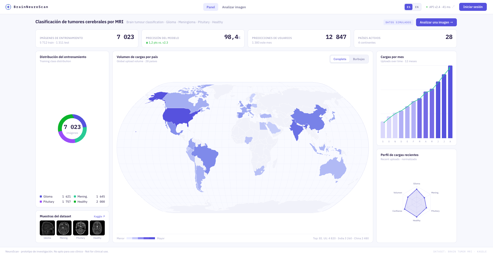
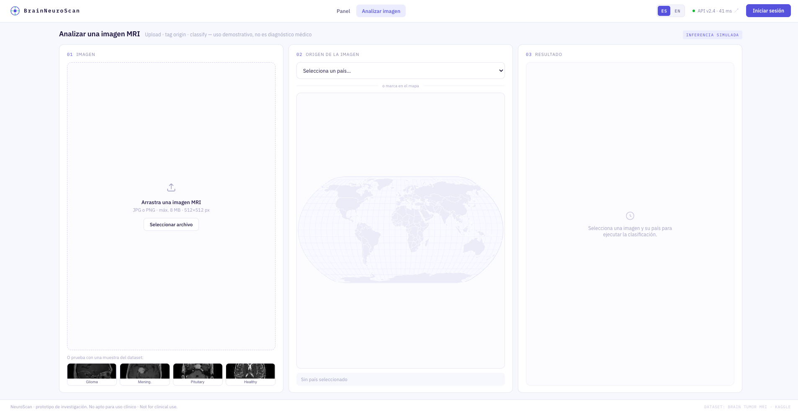
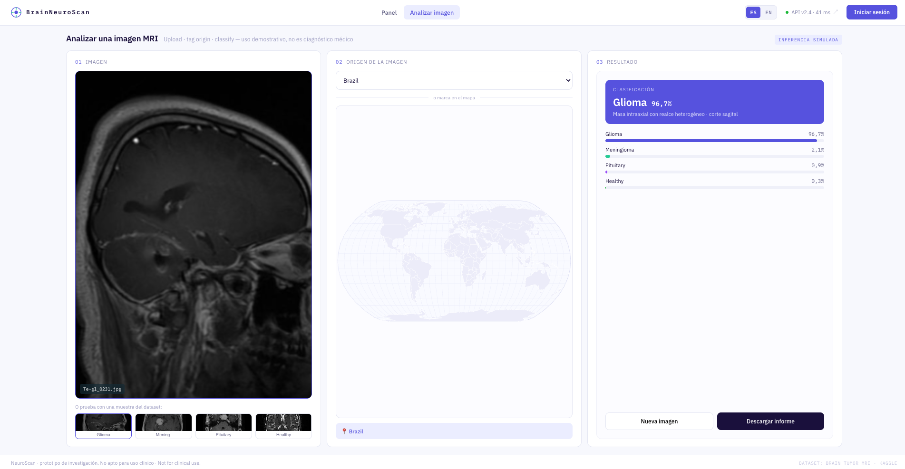
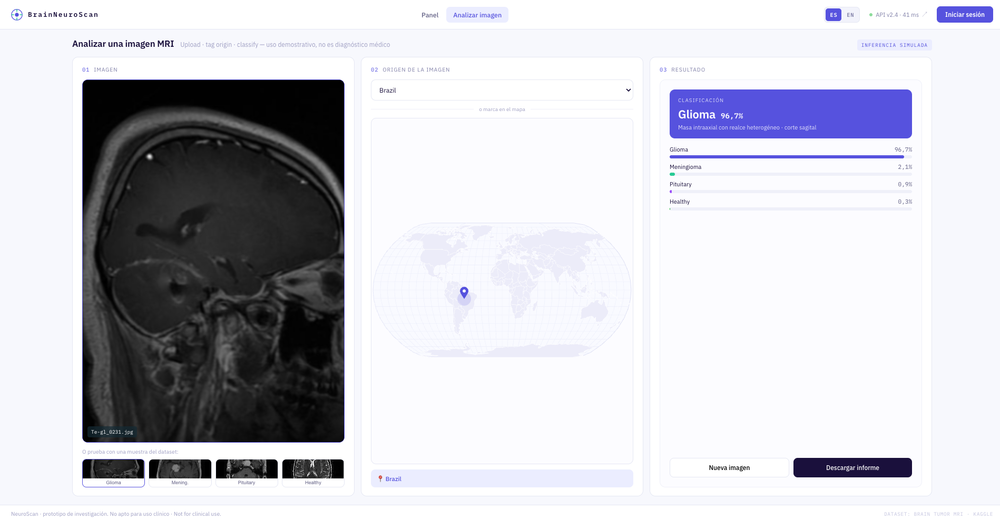
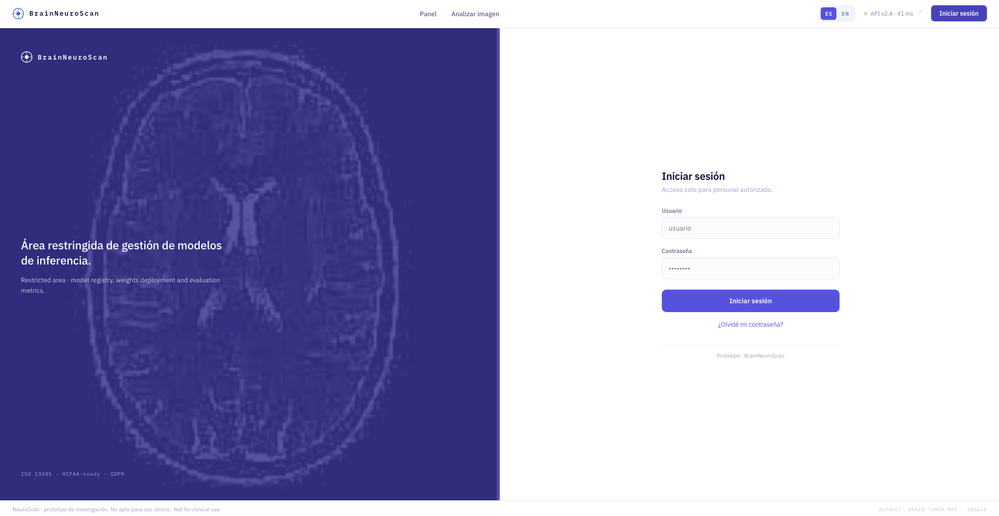
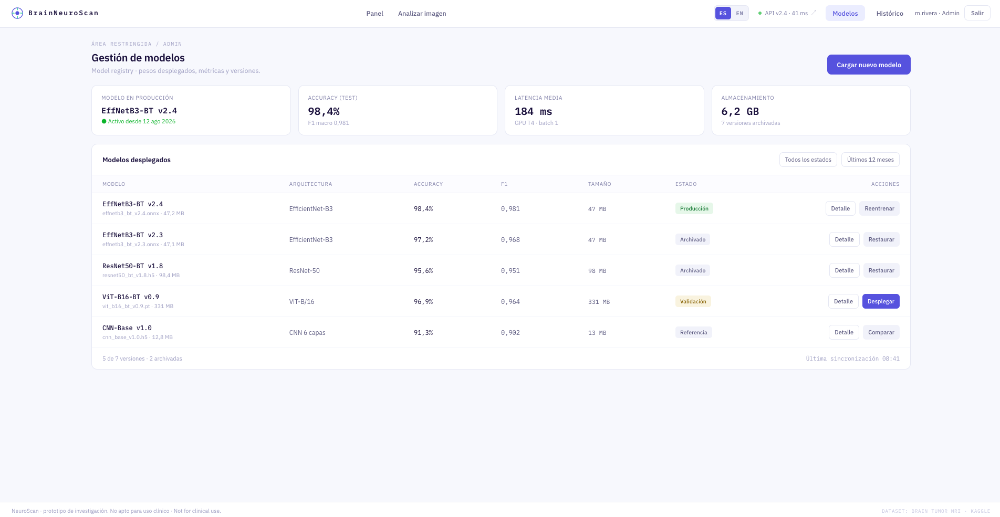
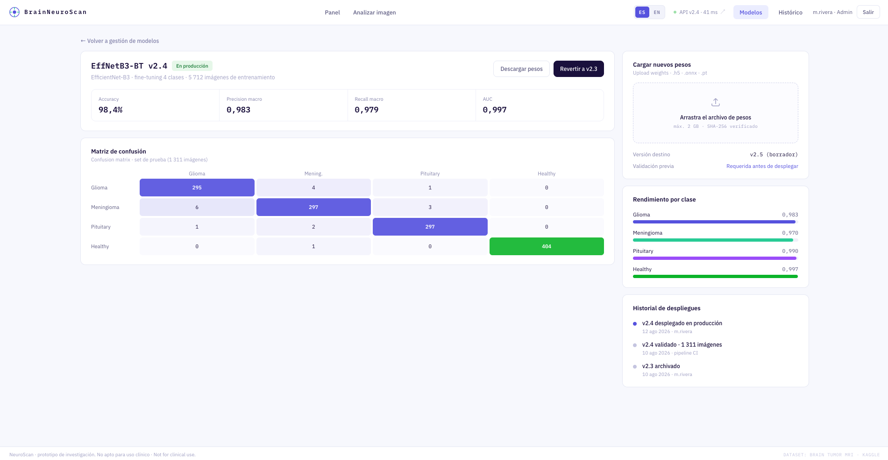
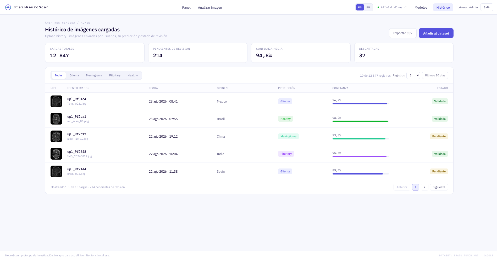
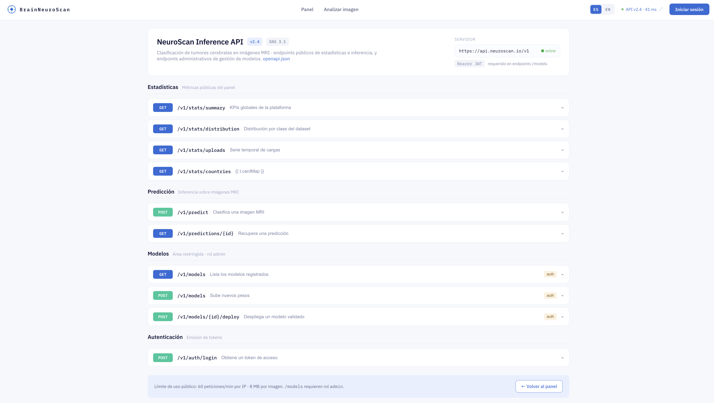

# Descripción del Prototipo de la Solución: BrainNeuroScan

**BrainNeuroScan** es una plataforma integral de analítica, inferencia de modelos de Deep Learning y gestión de ciclo de vida MLOps para la detección y clasificación asistida de tumores cerebrales a partir de imágenes de Resonancia Magnética (MRI). El sistema cubre de extremo a extremo la exploración de métricas globales, el análisis interactivo de imágenes por parte de usuarios finales, el control y versionamiento de artefactos de Machine Learning, la auditoría y evaluación del historial de inferencias, así como la exposición de servicios mediante APIs REST estandarizadas.

El prototipo está estructurado en los siguientes módulos:

---

## 1. Dashboard Principal (Panel Global de Monitoreo)

El Dashboard Principal ofrece una vista panorámica y en tiempo real del estado de la plataforma, el rendimiento del modelo en producción y las estadísticas globales de uso e ingesta de datos.

### Componentes e Indicadores Clave:
- **Tarjetas de KPIs Superiores:**
  - **Imágenes de Entrenamiento:** Volumen total del dataset base (7.023 imágenes: 5.712 de entrenamiento y 1.311 de pruebas).
  - **Precisión del Modelo en Producción:** Métrica de *Accuracy* global del modelo activo (98,4%, con un incremento de +1,2 pts frente a la versión v2.3).
  - **Predicciones Realizadas:** Contador acumulado de inferencias solicitadas por usuarios.
  - **Cobertura Geográfica:** Cantidad de países activos con cargas registradas.
- **Distribución del Dataset de Entrenamiento:** Gráfico de dona que desglosa el balance de clases del dataset (`Glioma`: XXX, `Meningioma`: XXX, `Pituitary`: XXX, `Healthy`: XXX).
- **Volumen de Cargas por País:** Mapa interactivo y visualización por burbujas que ilustra el origen geográfico de las resonancias enviadas a la plataforma (Top de Paises).
- **Serie Temporal de Cargas:** Gráfico de barras y línea de tendencia con el histórico mensual de actividad durante los últimos 12 meses.
- **Perfil de Cargas Recientes:** Gráfico de radar normalizado para monitorizar las clases detectadas y niveles de confianza en los últimos envíos.
- **Muestras del Dataset:** Galería de imágenes de referencia representativas para cada una de las 4 patologías/condiciones, con enlace directo al repositorio original en Kaggle.

---

## 2. Módulo de Análisis e Inferencia de Imágenes MRI

Este módulo permite a los profesionales o usuarios interactuar directamente con el modelo de clasificación. El flujo de trabajo está guiado en tres pasos secuenciales:

1. **Carga o Selección de la Imagen (Paso 01):** Zona de arrastre (*drag and drop*) que admite formatos JPG/PNG (hasta 8 MB, resolución recomendada 512×512 px) o selección rápida entre muestras precargadas del dataset (`Glioma`, `Meningioma`, `Pituitary`, `Healthy`).
2. **Geolocalización y Metadatos de Origen (Paso 02):** Selector de país o selección interactiva directa sobre el mapa mundial para etiquetar la procedencia del estudio clínico.
3. **Resultado de la Inferencia y Diagnóstico Asistido (Paso 03):** Presentación del diagnóstico predicho con su porcentaje de confianza principal (ej. *Glioma 96,7%*), descripción radiológica preliminar (ej. *Masa intraaxial con realce heterogéneo en corte sagital*), desglose probabilístico para todas las clases evaluadas, opción para iniciar un nuevo análisis y descarga del informe estructurado.

### Vista de Carga Inicial:

### Vista de Inferencia y Resultados:

### Vista con Localización Geográfica Seleccionada:

---

## 3. Autenticación y Control de Acceso al Módulo de Administración

Pantalla de inicio de sesión seguro para roles técnicos y administrativos (ingenieros de Machine Learning, especialistas MLOps y administradores del sistema).

### Características:
- Formulario de autenticación con credenciales individuales (Usuario y Contraseña) y mecanismo de recuperación de acceso.
- Panel informativo con identificadores de estándares de cumplimiento normativo y seguridad de datos médicos (*ISO 13485*, *HIPAA-ready*, *GDPR*).
- Restricción de acceso para la gobernanza de pesos, modelos y datos sensibles.

---

## 4. Gestión y Registro de Modelos (Model Registry)

Panel de administración MLOps diseñado para monitorear el inventario de modelos, el rendimiento de cada versión y gestionar los despliegues a producción.

### Componentes Clave:
- **Resumen del Modelo en Producción:** Identificador del modelo activo (`EffNetB3-BT v2.4`), fecha de puesta en marcha, métricas globales (*Accuracy* 98,4%, *F1 macro* 0,981), latencia media de inferencia (184 ms en GPU T4 con *batch size* = 1) y uso de almacenamiento de artefactos (6,2 GB distribuidos en 7 versiones).
- **Tabla de Versiones y Artefactos:** Catálogo detallado de modelos registrados que incluye:
  - **Identificador y Formato:** Nombre de versión y archivo de pesos (`.onnx`, `.h5`, `.pt`).
  - **Arquitectura:** Redes evaluadas (EfficientNet-B3, ResNet-50, ViT-B/16, CNN personalizada).
  - **Métricas:** *Accuracy* y *F1 Score* sobre el conjunto de test.
  - **Tamaño:** Peso en disco del artefacto empaquetado.
  - **Estado:** Etiquetas de ciclo de vida (`Producción`, `Validación`, `Archivado`, `Referencia`).
  - **Acciones Disponibles:** Botones contextuales para ver detalle, reentrenar, restaurar versión previa, comparar o desplegar directamente a producción.
- **Acceso a Carga:** Botón principal para subir y registrar nuevos pesos de modelos.

---

## 5. Detalle de Evaluación, Métricas y Carga de Nuevos Modelos

Vista técnica avanzada para la inspección detallada del desempeño de un modelo seleccionado y la incorporación de nuevas iteraciones entrenadas.

### Funcionalidades:
- **Métricas de Evaluación Global:** Tarjetas de rendimiento con *Accuracy* (98,4%), *Precision macro* (0,983), *Recall macro* (0,979) y *Área bajo la curva ROC (AUC)* (0,997).
- **Matriz de Confusión Interactiva:** Visualización del cruce de predicciones vs. etiquetas reales sobre el conjunto de prueba (1.311 imágenes) para auditar falsos positivos y falsos negativos por patología.
- **Rendimiento Individual por Clase:** Barras de puntaje desagregadas para cada clase diagnóstica.
- **Carga de Nuevos Pesos:** Zona de carga para incorporar artefactos (`.h5`, `.onnx`, `.pt` con verificación de integridad mediante hash SHA-256) asignando versión en borrador (*draft*) sujeta a validación previa obligatoria antes de autorizar el despliegue.
- **Historial de Despliegues y Rollback:** Trazabilidad de eventos de despliegue, ejecución de pipelines de CI/CD y botón de reversión rápida (*Rollback*) hacia la versión estable anterior.

---

## 6. Histórico de Cargas y Curación de Datos (Data Governance)

Módulo de auditoría y gestión continua de las imágenes ingresadas al sistema por los usuarios, facilitando estrategias de aprendizaje activo (*Active Learning*) y reentrenamiento supervisado.

### Componentes Clave:
- **Métricas de Ingesta:** Cargas totales procesadas (12.847), imágenes pendientes de validación por expertos (214), nivel de confianza promedio (94,8%) e imágenes descartadas por baja calidad o inconsistencia (37).
- **Tabla de Auditoría de Inferencias:**
  - Miniatura de la resonancia magnética analizada.
  - Identificador único de transacción y nombre de archivo original.
  - Marca temporal exacta (fecha y hora).
  - País de procedencia reportado.
  - Clase predicha y barra porcentual de confianza asignada por el modelo.
  - Estado de curación del dato (`Validada`, `Pendiente`, `Descartada`).
- **Filtros y Herramientas:** Búsqueda rápida por patología, filtrado por ventana de tiempo (últimos 30 días), paginador configurable, exportación del histórico a CSV y botón de acción masiva **"Añadir al dataset"** para integrar casos validados en nuevos ciclos de entrenamiento.

---

## 7. Documentación y Catálogo de APIs REST (OpenAPI 3.1)

Portal interactivo de documentación de servicios web que expone las interfaces de programación de la plataforma BrainNeuroScan para su integración con sistemas externos (PACS, HIS, RIS u otras aplicaciones clínicas).

### Endpoints Estructurados por Dominio:
- **Estadísticas Públicas (`/v1/stats`):**
  - `GET /v1/stats/summary`: Retorna los KPIs globales de la plataforma.
  - `GET /v1/stats/distribution`: Obtiene la distribución de clases del dataset de entrenamiento.
  - `GET /v1/stats/uploads`: Provee la serie de tiempo de imágenes cargadas e inferencias.
  - `GET /v1/stats/countries`: Entrega los volúmenes agregados por país de origen.
- **Servicio de Inferencia (`/v1/predict`):**
  - `POST /v1/predict`: Procesa una imagen MRI enviada por el cliente y devuelve la clasificación con las probabilidades por clase.
  - `GET /v1/predictions/{id}`: Consulta el resultado y metadatos de una inferencia previamente ejecutada a través de su identificador único.
- **Gestión de Modelos - Área Restringida (`/v1/models` - Requiere Bearer JWT):**
  - `GET /v1/models`: Lista los modelos registrados en el repositorio central.
  - `POST /v1/models`: Sube y registra un nuevo archivo de pesos con sus metadatos de entrenamiento.
  - `POST /v1/models/{id}/deploy`: Ejecuta el despliegue automático del modelo especificado a producción.
- **Autenticación (`/v1/auth`):**
  - `POST /v1/auth/login`: Autentica credenciales y emite tokens JWT para el consumo de endpoints protegidos.
- **Políticas de Uso:** Límites de tasa configurados (60 peticiones/minuto por IP), tamaño máximo de payload (8 MB por imagen) e información de latencia y estado del servidor en tiempo real.

