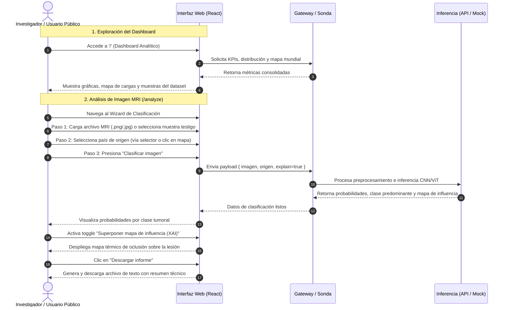
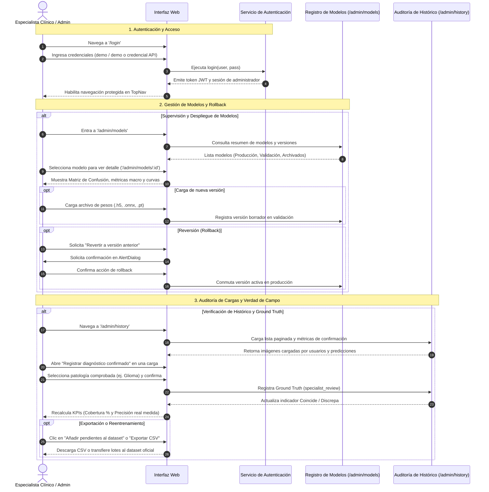

# BrainNeuroScan · Plataforma Web de Inferencia y Monitorización

Plataforma web de investigación para la clasificación asistida de tumores cerebrales a partir de imágenes de Resonancia Magnética (**MRI**), con soporte para cuatro clases diagnósticas: **Glioma**, **Meningioma**, **Pituitary** (Pituitario) y **Healthy** (Tejido Sano).

Diseñada con una arquitectura desacoplada en **React 19**, **TypeScript estricto** y **Tailwind CSS v4**, la interfaz cuenta con un sistema de **Gateway Híbrido** capaz de operar de manera completamente autónoma mediante datos y modelos simulados (*offline-first* con latencia calibrada) o conectarse fluidamente a una API REST en producción.

> [!WARNING]
> **Aviso de investigación:** Prototipo académico/demostrativo. No está certificado como dispositivo médico ni autorizado para diagnóstico clínico formal.

---

## Índice

1. [Características Principales](#características-principales)
2. [Stack Tecnológico](#stack-tecnológico)
3. [Diagrama de Componentes](#diagrama-de-componentes)
4. [Diagramas de Flujo de Usuarios](#diagramas-de-flujo-de-usuarios)
   - [Flujo 1: Investigador / Usuario Público](#flujo-1-investigador--usuario-público)
   - [Flujo 2: Administrador / Especialista Clínico](#flujo-2-administrador--especialista-clínico)
5. [Estructura del Proyecto](#estructura-del-proyecto)
6. [Catálogo de Vistas y Rutas](#catálogo-de-vistas-y-rutas)
7. [Arquitectura de Datos y Gateway Híbrido](#arquitectura-de-datos-y-gateway-híbrido)
8. [Puesta en Marcha y Desarrollo](#puesta-en-marcha-y-desarrollo)
9. [Variables de Entorno](#variables-de-entorno)
10. [Despliegue con Docker](#despliegue-con-docker)

---

## Características Principales

- **Dashboard Epidemiológico y Analítico:** Métricas agregadas (KPIs), mapa mundial coroplético/burbujas interactivo sin dependencias de API keys externas, tendencias temporales y distribución del dataset de entrenamiento.
- **Wizard de Inferencia en 3 Pasos:** Carga por arrastre (drag-and-drop) o selección de muestras testigo, etiquetado geoespacial de origen, inferencia en tiempo real y mapas de explicabilidad e influencia (XAI).
- **Área Administrativa Protegida (`/admin`):**
  - **Registro de Modelos (Model Registry):** Gestión de versiones (producción, validación, archivadas), métricas avanzadas (Accuracy, Precision Macro, Recall Macro, AUC), matriz de confusión interactiva y despliegue/rollback con un clic.
  - **Histórico y Verdad de Campo (Ground Truth Loop):** Auditoría de cargas de usuarios, registro de diagnóstico confirmado por patólogo/especialista, cálculo de cobertura y precisión real medida, exportación a CSV e incorporación directa al dataset de reentrenamiento.
- **Resiliencia Operativa:** Sonda activa de conectividad (`/health`) que conmuta entre API real y mocks únicamente ante fallas de red, garantizando demostraciones fluidas en cualquier entorno.
- **Experiencia de Usuario:** Soporte nativo para internacionalización bilingüe (**Español** / **Inglés**) y selector de tema dinámico (**Claro** / **Oscuro** / **Sistema**).

---

## Stack Tecnológico

| Capa / Dominio | Tecnologías Principales |
|---|---|
| **Core & Runtime** | [React 19](https://react.dev/), [TypeScript 6](https://www.typescriptlang.org/), [Vite 8](https://vite.dev/) |
| **Estilos & UI** | [Tailwind CSS v4](https://tailwindcss.com/), [shadcn/ui](https://ui.shadcn.com/) (primitivas [Radix UI](https://www.radix-ui.com/)), `class-variance-authority`, `lucide-react` |
| **Enrutamiento y Estado** | [React Router v7](https://reactrouter.com/), [TanStack Query v5](https://tanstack.com/query/latest) (cacheo y revalidación asíncrona) |
| **Visualización de Datos** | [Recharts 3](https://recharts.org/) (barras, donas, radar), [react-simple-maps](https://www.react-simple-maps.io/) + [world-atlas](https://github.com/topojson/world-atlas) (coropletas geográficas) |
| **I18n & Temas** | Motor propio tipado con persistencia en `localStorage` (ES/EN) y clases CSS para dark mode |
| **Linter & Empaquetado** | [oxlint](https://oxc.rs/) (linter ultrarrápido), Docker multi-stage (Node.js build + Nginx Alpine) |

---

## Diagrama de Componentes

La siguiente vista arquitectónica ilustra la separación de capas de la aplicación web, desde los componentes visuales hasta el sistema de integración resiliente con el backend:

```mermaid
graph TD
    subgraph UI_Layer["Capa de Presentación (UI & Layouts)"]
        TopNav["TopNav (Barra Superior & Herramientas)"]
        AdminShell["AdminShell (Estructura de Admin)"]
        
        subgraph Views["Páginas y Vistas (React Router)"]
            P_Dash["DashboardPage ('/')"]
            P_Analyze["AnalyzeImagePage ('/analyze')"]
            P_Login["LoginPage ('/login')"]
            P_Models["ModelManagementPage ('/admin/models')"]
            P_ModelDetail["ModelDetailPage ('/admin/models/:id')"]
            P_History["UploadHistoryPage ('/admin/history')"]
        end

        subgraph Feature_Components["Componentes de Dominio"]
            FC_Dash["KpiCards · ChartCards · SampleGallery"]
            FC_Analyze["ImageDropzone · CountryPicker · ResultPanel · InfluenceMap"]
            FC_AdminM["ModelsTable · WeightsUploader · ConfusionMatrix · ClassPerf"]
            FC_AdminH["UploadHistoryTable · GroundTruthDialog · ClassTabs"]
        end

        subgraph Visualizers["Visualización y Primitivas"]
            Charts["Recharts (Donut, Bars, Radar)"]
            Maps["React Simple Maps (World Choropleth)"]
            Shadcn["shadcn/ui + Radix UI Primitives"]
        end
    end

    subgraph State_Layer["Capa de Estado y Lógica de Negocio"]
        AuthCtx["AuthProvider (useAuth · JWT / Sesión)"]
        I18nCtx["I18nProvider (useI18n · ES/EN)"]
        ThemeCtx["ThemeProvider (useTheme · Light/Dark)"]
        QueryClient["TanStack Query (Caché & Mutaciones)"]

        subgraph Custom_Hooks["Hooks de Dominio"]
            H_Dash["useDashboardData"]
            H_Classify["useClassifyImage"]
            H_Models["useModels"]
            H_History["useUploadHistory"]
            H_Backend["useBackendStatus"]
        end
    end

    subgraph Service_Layer["Capa de Servicios y Abstracción de Red"]
        S_Auth["auth.service"]
        S_Class["classification.service"]
        S_Dash["dashboard.service"]
        S_Models["models.service"]
        S_Hist["uploads.service"]
        
        Gateway["Gateway Híbrido (gateway.ts)\n• Sonda /health periódica\n• Fallback selectivo por fallo de red"]
        ApiClient["ApiClient (client.ts · fetch + JWT)"]
    end

    subgraph Data_Layer["Capa de Datos y Orígenes"]
        BackendAPI["FastAPI / Backend REST\n(Endpoints /api/v1/*)"]
        MockEngine["Motor Mock (src/mocks/*)\n(Simuladores + Latencia de Red)"]
    end

    %% Relaciones UI a Estado/Hooks
    TopNav --> AuthCtx & I18nCtx & ThemeCtx & H_Backend
    P_Dash --> H_Dash & FC_Dash
    P_Analyze --> H_Classify & FC_Analyze
    P_Login --> AuthCtx
    P_Models --> H_Models & FC_AdminM
    P_ModelDetail --> H_Models & FC_AdminM
    P_History --> H_History & FC_AdminH

    FC_Dash --> Charts & Maps
    FC_Analyze --> Maps & Shadcn
    FC_AdminM --> Charts & Shadcn
    FC_AdminH --> Shadcn

    %% Hooks a TanStack Query y Servicios
    H_Dash --> QueryClient & S_Dash
    H_Classify --> QueryClient & S_Class
    H_Models --> QueryClient & S_Models
    H_History --> QueryClient & S_Hist
    H_Backend --> Gateway

    %% Servicios al Gateway y ApiClient
    S_Auth & S_Class & S_Dash & S_Models & S_Hist --> Gateway
    Gateway --> ApiClient
    Gateway -.->|Si está Online| BackendAPI
    Gateway -.->|Si está Offline o Timeout| MockEngine
```



---

## Diagramas de Flujo de Usuarios

La plataforma admite dos perfiles de usuario bien diferenciados: **Investigador / Usuario General** (acceso público) y **Administrador / Especialista Clínico** (acceso autenticado).

### Flujo 1: Investigador / Usuario Público

Orientado a la exploración estadística del dataset y a la ejecución de pruebas diagnósticas con análisis de explicabilidad e informe descargable.



---

### Flujo 2: Administrador / Especialista Clínico

Orientado al control de calidad del modelo, auditoría de inferencias realizadas por usuarios y mejora continua mediante el registro de *Ground Truth* (Verdad de Campo).



---

## Estructura del Proyecto

El proyecto sigue una estructura modular orientada por características (*feature-based*), separando estrictamente la presentación de la lógica de negocio y las fuentes de datos:

```text
web/
├── .env.example                 # Plantilla de variables de entorno documentada
├── .env.development            # Variables por defecto para desarrollo local
├── .env.production             # Variables optimizadas para compilación productiva
├── .oxlintrc.json              # Configuración del linter estricto Oxlint
├── Dockerfile                  # Construcción multi-stage (Node.js build + Nginx Alpine)
├── docker-compose.yml          # Orquestación del contenedor web local
├── docker/
│   └── nginx.conf              # Servidor Nginx con soporte SPA fallback y /health
├── index.html                  # Punto de entrada HTML con fuentes y metadatos SEO
├── package.json                # Dependencias, scripts y metadatos del proyecto
├── tsconfig.json               # Configuración TypeScript base y rutas @/*
├── vite.config.ts              # Configuración de Vite con Tailwind v4 y alias de path
└── src/
    ├── main.tsx                # Bootstrap de React y montaje en el DOM
    ├── index.css               # Sistema de diseño con tokens Tailwind CSS v4 y variables HSL
    │
    ├── app/                    # Orquestación global de la aplicación
    │   ├── App.tsx             # Proveedores globales (Theme, I18n, QueryClient, Auth)
    │   └── router.tsx          # Definición declarativa de rutas públicas y protegidas
    │
    ├── components/             # Jerarquía de componentes reutilizables
    │   ├── charts/             # Gráficos analíticos Recharts (Donut, Bars, Radar)
    │   ├── features/           # Módulos visuales organizados por dominio:
    │   │   ├── admin/          # Componentes de gestión de modelos y auditoría:
    │   │   │   ├── history/    # Tablas de histórico, filtros y modales de Ground Truth
    │   │   │   ├── model-detail/ # Matriz de confusión, rendimiento por clase y timeline
    │   │   │   └── models/     # Tabla de inventario de modelos y badges de estado
    │   │   ├── analyze/        # Wizard de análisis: dropzone, muestras y panel de resultados
    │   │   ├── auth/           # Formularios de inicio de sesión y paneles divididos
    │   │   └── dashboard/      # Tarjetas KPI, tarjetas de gráficos y galería de muestras
    │   ├── layout/             # Estructura visual (TopNav, AdminShell, Footer, ThemeToggle)
    │   ├── maps/               # Visualización geográfica (World Choropleth y Country Picker)
    │   ├── shared/             # Componentes compartidos (MriThumbnail con lazy-loading)
    │   └── ui/                 # Catálogo shadcn/ui estilizado con Radix UI primitives
    │
    ├── hooks/                  # Custom Hooks desacoplados (TanStack Query + State)
    │   ├── useAuth.tsx         # Contexto y hook de sesión de usuario y privilegios
    │   ├── useBackendStatus.ts # Suscripción reactiva al estado del Gateway y latencia
    │   ├── useClassifyImage.ts # Mutación de clasificación e información de modelo activo
    │   ├── useDashboardData.ts # Consultas analíticas, KPIs, tendencias y muestras
    │   ├── useModels.ts        # Consultas y mutaciones de modelos, pesos y reversiones
    │   └── useUploadHistory.ts # Consultas paginadas, exportación a CSV y Ground Truth
    │
    ├── i18n/                   # Sistema de internacionalización
    │   ├── I18nProvider.tsx    # Proveedor de contexto y traductor interpolado
    │   ├── dictionaries.ts     # Tipado estricto de claves y catálogo de idiomas
    │   ├── en.json             # Diccionario en idioma inglés
    │   └── es.json             # Diccionario en idioma español
    │
    ├── lib/                    # Utilidades transversales y clientes de red
    │   ├── api/
    │   │   ├── client.ts       # Cliente fetch con interceptores de timeout y token Bearer
    │   │   └── gateway.ts      # Gateway de conmutación inteligente Online/Offline
    │   ├── theme/
    │   │   └── ThemeProvider.tsx # Manejo de modo claro/oscuro/sistema con clase CSS
    │   ├── env.ts              # Validación tipada de variables de entorno VITE_*
    │   ├── format.ts           # Formateadores numéricos, porcentajes y fechas localizadas
    │   ├── geo.ts              # Utilidades de coordenadas y mapas TopoJSON
    │   ├── mri-samples.ts      # Catálogo de imágenes MRI de prueba en formato SVG inline
    │   ├── tumor-class-colors.ts # Paleta de colores estándar por tipo de tumor
    │   └── utils.ts            # Combinador de clases utilitarias (clsx + tailwind-merge)
    │
    ├── mocks/                  # Datos de simulación offline para desarrollo desacoplado
    │   ├── classification.mock.ts # Simulador de inferencia y generador de mapas de influencia
    │   ├── countries.mock.ts   # Catálogo mundial de países con ISO-3166 y coordenadas
    │   ├── dashboard.mock.ts   # Mocks de KPIs, tendencias mensuales y perfiles radar
    │   ├── models.mock.ts      # Inventario de modelos, matrices de confusión y métricas
    │   └── uploads.mock.ts     # Registro histórico de cargas y verdad de campo
    │
    ├── pages/                  # Vistas principales vinculadas al router
    │   ├── AnalyzeImagePage.tsx # Wizard interactivo de inferencia y explicabilidad
    │   ├── DashboardPage.tsx   # Panel analítico central y mapa interactivo
    │   ├── LoginPage.tsx       # Acceso seguro al área de administración
    │   ├── NotFoundPage.tsx    # Manejo de rutas inexistentes (404)
    │   └── admin/              # Vistas exclusivas de administración:
    │       ├── ModelDetailPage.tsx     # Detalle profundo, métricas y descarga de pesos
    │       ├── ModelManagementPage.tsx # Inventario y acciones de despliegue de modelos
    │       └── UploadHistoryPage.tsx   # Auditoría de inferencias y verificación Ground Truth
    │
    ├── services/               # Adaptadores de comunicación (orquestan Gateway vs Mocks)
    │   ├── auth.service.ts     # Autenticación contra API o sesión demo
    │   ├── classification.service.ts # Inferencia de imágenes y generación de reporte
    │   ├── dashboard.service.ts # Métricas consolidadas del dashboard
    │   ├── delay.ts            # Inyector de latencia artificial para simular red
    │   ├── models.service.ts   # Operaciones sobre el registro de modelos
    │   └── uploads.service.ts  # Manejo del histórico y registro de verdad de campo
    │
    └── types/                  # Definición de tipos de datos de dominio
        ├── auth.ts             # Sesión, usuario y credenciales
        ├── classification.ts   # Clases tumorales, predicciones y mapa de explicabilidad
        ├── country.ts          # Estructuras de datos geoespaciales
        ├── model.ts            # Modelos, métricas, matrices de confusión e histórico
        └── upload.ts           # Registros de carga, estado y verdad de campo
```

---

## Catálogo de Vistas y Rutas

| Ruta | Acceso | Propósito | Características Clave |
|---|---|---|---|
| `/` | Público | **Dashboard Analítico** | KPIs globales, distribución por tipo de tumor (Donut), mapa mundial interactivo (Coropleta/Burbujas), volumen mensual (Bars) y perfil de confianza (Radar). |
| `/analyze` | Público | **Wizard de Inferencia** | Proceso guiado en 3 pasos: carga de imagen/muestra, asignación de origen geográfico, inferencia, mapa de calor de explicabilidad (XAI) y descarga de reporte. |
| `/login` | Público | **Control de Acceso** | Formulario de autenticación con credenciales demo preconfiguradas (`demo` / `demo`) o integración con token JWT del backend. |
| `/admin/models` | Protegido | **Registro de Modelos** | Tabla comparativa de versiones de modelos, estado (producción/archivado/validación), carga de nuevos pesos y acciones de despliegue directo. |
| `/admin/models/:id` | Protegido | **Detalle de Modelo** | Matriz de confusión interactiva, desglose de métricas por clase tumoral, timeline de auditoría de despliegues, descarga de pesos y botón de rollback. |
| `/admin/history` | Protegido | **Auditoría & Ground Truth** | Histórico de todas las imágenes clasificadas, filtros por patología, paginación, modal para registrar diagnóstico confirmado por patólogo y exportación a CSV. |
| `*` | Público | **Página No Encontrada (404)** | Manejo elegante de rutas inexistentes con enlace de retorno al panel principal. |

---

## Arquitectura de Datos y Gateway Híbrido

Para permitir tanto el desarrollo autónomo en local como la integración transparente con una API en la nube o en contenedores Docker, la aplicación implementa un patrón **Gateway Centralizado** (`src/lib/api/gateway.ts`):

1. **Sonda de Salud Activa (`GET /health`):**
   - Se evalúa al inicializar la aplicación, de forma periódica (`VITE_HEALTH_POLL_MS`) y bajo demanda al pulsar el indicador de estado en la barra superior.
   - Si la sonda responde con éxito, el sistema pasa a estado **Online** y consume los endpoints de la API (`VITE_API_BASE_URL`).
   - El indicador visual (`ApiStatusIndicator`) muestra la latencia en milisegundos y un punto verde.

2. **Diferenciación Estricta de Fallos:**
   - **Fallo de Conectividad (Red caída, timeout, conexión rechazada):** El gateway conmuta automáticamente a los servicios simulados (`src/mocks/*`), advirtiendo al usuario mediante un badge amarillo (*"Sin backend · datos simulados"*).
   - **Error HTTP (401, 404, 500):** El error **no se enmascara**. Se propaga a la capa de presentación para que la aplicación muestre el error real o redirija a la autenticación, evitando falsas confirmaciones con datos simulados.

3. **Inyección de Latencia Realista:**
   - Cuando opera en modo simulado, cada servicio añade una demora intencional controlada (`src/services/delay.ts`, ~300-800ms) para garantizar que los estados de carga (*skeletons*, *spinners* y transiciones) se prueben en condiciones cercanas a una red real.

---

## Puesta en Marcha y Desarrollo

### Requisitos Previos

- **Node.js** v20.x o superior
- **npm** v10.x o superior (o gestor compatible como `pnpm` o `bun`)

### Instalación y Ejecución Local

```bash
# 1. Clonar el repositorio y posicionarse en la carpeta web
cd web

# 2. Instalar dependencias del proyecto
npm install

# 3. Iniciar servidor de desarrollo con Hot Module Replacement (HMR)
npm run dev
```

La aplicación estará disponible en `http://localhost:5173`.

### Comandos de Utilidad

```bash
npm run build     # Verificación de tipos TypeScript y compilación productiva a dist/
npm run preview   # Servidor HTTP local para previsualizar el build de dist/
npm run lint      # Ejecuta el linter estricto oxlint en todo el código fuente
```

---

## Variables de Entorno

Copia el archivo `.env.example` a `.env.local` para aplicar configuraciones personalizadas:

```bash
cp .env.example .env.local
```

| Variable | Valor por Defecto | Descripción |
|---|---|---|
| `VITE_API_BASE_URL` | `http://localhost:8000` | URL base del backend REST. Si está vacía o es inalcanzable, conmuta a modo simulado. |
| `VITE_API_TIMEOUT_MS` | `15000` | Tiempo límite en milisegundos para solicitudes a la API antes de abortar. |
| `VITE_HEALTH_TIMEOUT_MS` | `3000` | Tiempo de espera máximo de la sonda de salud (`/health`). |
| `VITE_HEALTH_POLL_MS` | `30000` | Intervalo de sondeo periódico de salud (`0` desactiva el sondeo automático). |
| `VITE_FORCE_MOCKS` | `false` | Establecer en `true` para forzar el uso de mocks ignorando cualquier backend disponible. |

> [!NOTE]
> Las variables con prefijo `VITE_` son incrustadas estáticamente en el bundle de producción durante la fase de compilación (`npm run build`). En entornos Docker se parametrizan mediante `ARG`.

---

## Despliegue con Docker

El proyecto incluye un `Dockerfile` multi-stage optimizado que compila la aplicación con Node.js y la sirve mediante un servidor ultraligero **Nginx Alpine**:

### Ejecución con Docker Compose

Para levantar el entorno completo de la plataforma web:

```bash
docker compose up --build -d
```

La aplicación quedará expuesta en `http://localhost:8080`.

### Construcción y Ejecución Manual

```bash
# Construir la imagen Docker
docker build -t brainneuroscan-web .

# Ejecutar el contenedor mapeando el puerto 8080
docker run -d --name brainneuroscan-web -p 8080:80 brainneuroscan-web
```

El servidor Nginx está configurado con soporte para el sistema de enrutamiento SPA (*fallback* a `index.html`), compresión de recursos estáticos y un endpoint local `/health` para monitorización de salud del contenedor.
